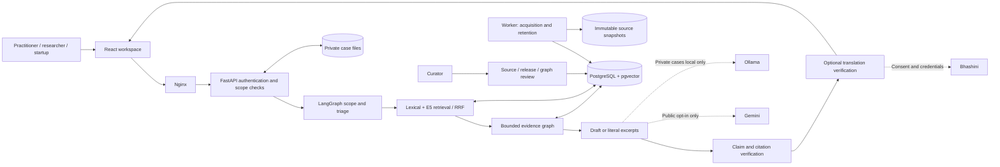
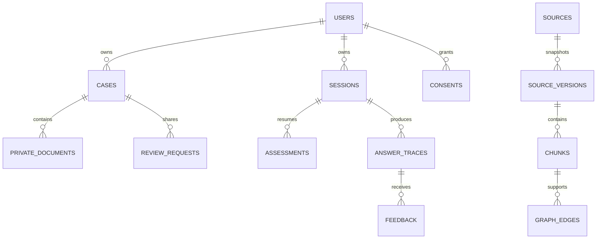
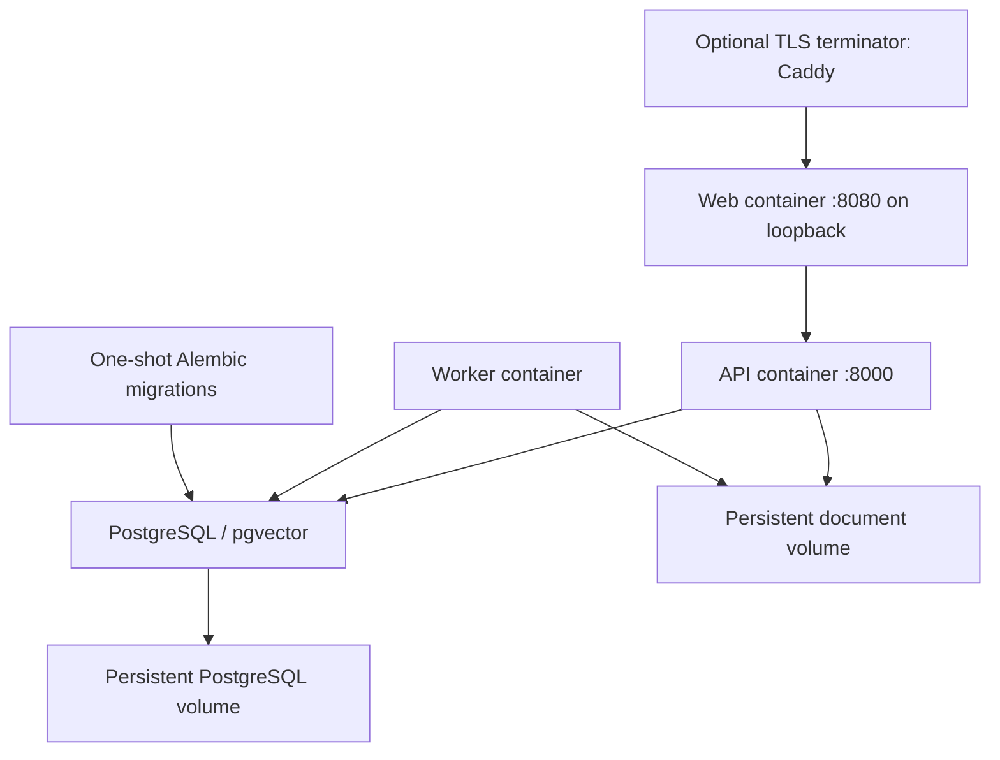

# Architecture and data flow

The API enforces identity, jurisdiction, consent and source eligibility before invoking the model. Retrieval works without generation. A generated answer is released only after chunk-ID resolution, exact-quote validation and a second entailment check. A model judge remains fallible; expert evaluation is a separate gate.

## Trust boundaries

Browser input, uploaded documents, retrieved text and provider output are untrusted. Public-source snapshots and private case documents use separate paths and tables. Cases never enter public search. Source instructions cannot authorize tools, payments, uploads or connector access. The model has no general shell, database or network tool.

No cross-jurisdiction fallback is allowed. India uses market `treaties` as its neutral internal value; international retrieval additionally requires `treaties`, `us`, `eu` or `uk`. Comparison performs two independent retrieval runs. Graph expansion obeys the same source/version/jurisdiction filters.

## Database structure

`corpus_releases.version_ids` records the active snapshot set. `answer_traces` records hashed question, model configuration, prompt version, corpus release, returned chunk IDs and timing without storing raw guest questions. Case history is stored only when explicitly saved or queried within a signed-in case. `jobs` supports claims with PostgreSQL row locking, retries and interruption recovery. `evaluation_runs` stores reproducible report metadata. Database migrations create full-text GIN and pgvector HNSW indexes.

## Retrieval and execution limits

Section-aware page chunks retain raw offsets, headings and page numbers. The portable lexical path uses BM25-style weighting; PostgreSQL full-text retrieval augments it. Local E5 and lexical candidates are merged with reciprocal-rank fusion. English word normalization and an EN/HI/MR glossary improve matching. Category weighting helps distinguish patent questions from product classification questions. It is a retrieval heuristic, not a legal decision rule.

At most 8 initial chunks and 10 after graph expansion enter context. Graph edges are capped; the LangGraph recursion limit is 8, drafting returns at most 5 claims, and provider requests have timeouts. No unbounded autonomous research agent is enabled. Remote acquisition has publisher allowlisting, redirect checks and a 35 MB cap. OCR is explicit; recovered pages retain review warnings.

## Deployment

The default Compose deployment uses one API process. A shared gateway limiter and session-aware rate enforcement are required before scaling API replicas. Docker provides persistence, not disk encryption; the host or storage service must protect data at rest. No public hosting is provisioned.
