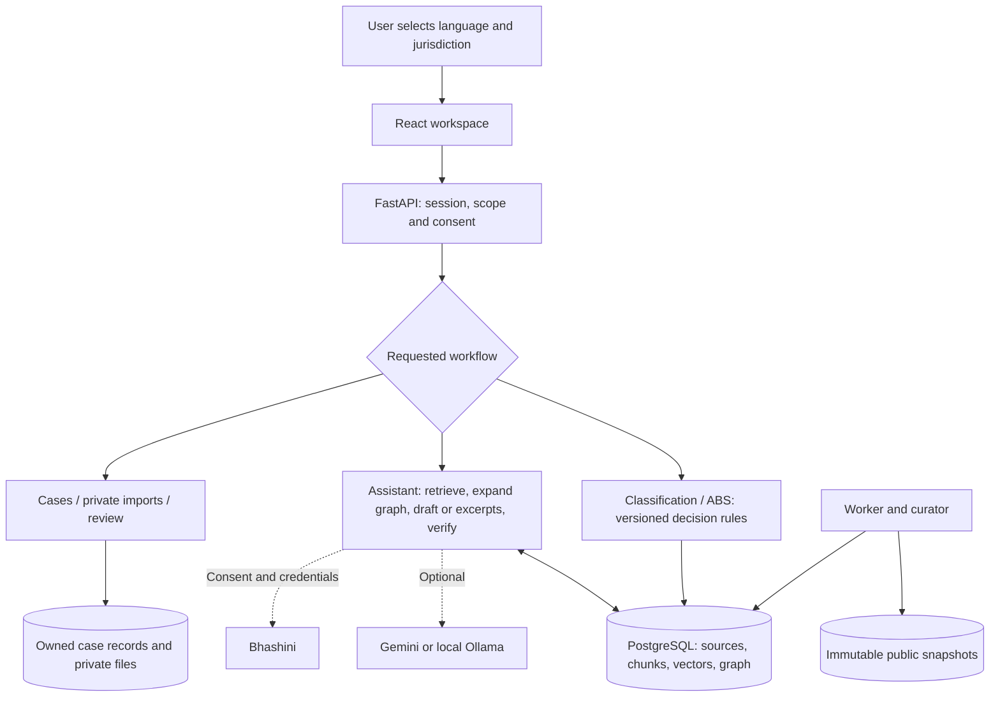

# IP-SAKTI Sahayak — modules, workflows and technology

**Implementation update:** See [RAG_SETUP.md](RAG_SETUP.md) for the newer LLM query-planning, multi-query vector retrieval and reference-summary policy. Embeddings now default to enabled. With reference synthesis enabled, unreviewed eligible sources can support explicitly partial AI summaries; the approved-only generation descriptions in the original module inventory below describe the earlier baseline.

This guide explains what each module does for a real user, how the implementation works internally, and which technologies support it. It describes the repository as of 6 September 2026. Examples illustrate software behavior; they are not legal determinations.

**Status vocabulary:** “Implemented” means there is executable pilot code. “Configuration required” means a model, credentials or deployment setup is needed. “Review required” means software checks do not replace qualified legal, language or security review. A feature can have all three statuses. The authoritative completion register is [FEATURE_STATUS.md](FEATURE_STATUS.md).

## 1. System at a glance

| Layer | Technologies | Responsibility |
|---|---|---|
| User interface | React 19, TypeScript, Vite, Tailwind CSS, Radix UI primitives, Shadcn-style local components, Lucide icons | Workspace, forms, source viewer, cases and administration |
| API | Python, FastAPI, Pydantic, Uvicorn | Validate requests, enforce permissions and expose versioned contracts |
| Operational and retrieval database | PostgreSQL, pgvector, SQLAlchemy, Alembic | Users, evidence, vectors, cases, jobs, reviews and migrations |
| Development database | SQLite | Local fallback; does not provide PostgreSQL's indexed retrieval behavior |
| Retrieval | Python lexical scoring, PostgreSQL full-text search, multilingual E5-small, Sentence Transformers | Find relevant evidence within the selected scope |
| Answer workflow | LangGraph, HTTPX, optional Gemini or Ollama | Bounded retrieval, drafting, verification and fallback |
| Language and audio | Static EN/HI/MR dictionaries, Web Audio API, configurable Bhashini APIs | Localized screens, transcription, translation and playback |
| Documents | pypdf, Beautiful Soup, PDFium, Tesseract, ReportLab | Extraction, OCR, snapshots and PDF exports |
| Operations | Docker Compose, Nginx, separate Python worker, persistent volumes | Run services, process jobs, preserve data and restore backups |

Exact backend pins are in [requirements.txt](../backend/requirements.txt) and [requirements-models.txt](../backend/requirements-models.txt). Frontend resolved versions are in [package-lock.json](../frontend/package-lock.json); its package manifest contains version ranges. This project uses PostgreSQL directly; a Supabase subscription is not required.

## 2. Assistant workspace and conversation history

**In real life:** A researcher opens the app, chooses a language, and asks an IP or regulatory question. Suggested questions and shortcuts help someone who does not know the legal vocabulary. Results show claims or excerpts, evidence status, limitations and next steps.

**Technical operation:** React manages navigation, loading state, dialogs and conversation histories. Histories are keyed by jurisdiction, market and language. The chosen interface language is stored in browser local storage; ordinary guest conversation histories are React state rather than an account archive. Saving a case explicitly persists its history. The frontend API helper uses browser `fetch`, cookies and an `X-CSRF-Token` header.

**Stack and code:** React, TypeScript, Tailwind, Radix, Lucide; [App.tsx](../frontend/src/App.tsx), [pages.tsx](../frontend/src/pages.tsx), [lib.ts](../frontend/src/lib.ts), [style.css](../frontend/src/style.css).

**Status:** Implemented. Responsive layouts, keyboard-friendly controls and a persistent information-not-legal-advice notice are present; this is not a formal accessibility certification.

## 3. Jurisdiction isolation and export-market scope

**In real life:** A startup researching India can switch to US market guidance without treating Indian requirements as US requirements. Treaty-level, US, EU and UK contexts are separate. A comparison produces labelled India and international results.

**Technical operation:** The question contract carries `jurisdiction`, `market` and an optional `as_of` date. Database eligibility filters apply these fields before ranking. India uses `treaties` as a neutral internal market value. Graph expansion repeats the eligibility rules. `/questions/compare` performs two independent answer runs and disallows a saved case in that request. The UI clears the active case when changing scope.

**Stack and code:** Pydantic request models, SQLAlchemy filters, React state; [schemas.py](../backend/app/schemas.py), [retrieval.py](../backend/app/retrieval.py), [main.py](../backend/app/main.py).

**Status:** Implemented scope separation. Export guidance is scoped retrieval, not a separate market-access approval engine. Country/state details, treaty status and current-law completeness depend on reviewed sources; selecting a market does not establish that its corpus is complete.

## 4. IP-family routing

**In real life:** Someone asking about a product name should reach trademark material, while someone asking about an invention should reach patent material. The application also targets GI, copyright, designs, plant varieties and trade secrets.

**Technical operation:** Source records carry categories. Query normalization and category-sensitive lexical weighting favor relevant families; for example, a patent term increases the weight of patent-category chunks. General IP questions can proceed without completing formulation triage. This is deterministic retrieval routing, not a separately trained legal classifier.

**Stack and code:** Python regular expressions, token counters and source metadata; [retrieval.py](../backend/app/retrieval.py), [manifest.json](../corpus/manifest.json).

**Status:** Implemented retrieval heuristics. The broader coverage target exceeds the currently reviewed corpus; see [coverage.md](../corpus/coverage.md).

## 5. Formulation classification

**In real life:** A founder describes whether a product is for treatment, nutrition or appearance. The assistant asks relevant follow-up questions and offers a provisional route to discuss with an authority or facilitator.

**Technical operation:** A versioned Python decision table first asks intended use. Therapeutic answers branch through authoritative-text reference, unchanged formula/process, ingredient coverage and potentially the phytopharmaceutical route. Nutrition branches ask about an Ayurveda-Aahara basis. Administration route and biological origin are collected where applicable. Unknown answers can produce an uncertain outcome; an unestablished administration route also prevents a forced classification. Session-owned assessment records persist answers; each request returns the next unanswered question or a result. Results retrieve supporting India-source excerpts and separate regulatory, IP, TK and ABS explanations.

**Stack and code:** Python rule tables, Pydantic validation, SQLAlchemy `Assessment`, React question cards; `POST /api/v1/assessments/classification`, [assessments.py](../backend/app/assessments.py).

**Status:** Implemented provisional India flow for classical, proprietary, potential new-drug, phytopharmaceutical, Ayurveda-Aahara, food/nutraceutical, cosmetic and uncertain routes. It relies on user-declared facts and general retrieved support; it does not verify an original recipe or attach a separately approved statutory citation to every decision edge. Patent-or-proprietary is not treated as evidence of a granted patent. Detailed branch-by-branch legal review remains necessary.

## 6. Access-and-Benefit-Sharing assessment

**In real life:** A cultivator or startup records where material came from, who accessed it and how it will be used. The output is an authority/evidence checklist for a subsequent compliance discussion.

**Technical operation:** The current flow asks seven fields: Indian origin, applicant/entity status, purpose, overseas transfer, proposed IP activity, cultivation and associated TK. Deterministic rules select an NBA/SBB, research, origin-country or clarification route. Unknown facts remain visible. Retrieval filters specifically to ABS-category India sources before selecting citations.

**Stack and code:** The same versioned assessment engine and persistence as classification; `POST /api/v1/assessments/abs`, [assessments.py](../backend/app/assessments.py).

**Status:** Implemented preliminary checklist. All seven questions are currently asked; this is not yet a fully adaptive exemption analysis. It does not calculate fees, submit applications, grant approval or certify compliance. Cultivation is collected without automatically declaring an exemption.

## 7. Prior-art, botanical synonyms and TKDL navigation

**In real life:** A researcher enters “turmeric” and gets additional terms and search expressions to try in official databases. TKDL information explains that database access can be restricted.

**Technical operation:** `/prior-art` combines the entered term with a small explicit synonym dictionary covering ashwagandha, turmeric, neem and tulsi. It returns quoted OR expressions, a formulation/extract query and official IP India, PATENTSCOPE and TKDL entry links. Other terms are still accepted but receive no invented botanical synonym.

**Stack and code:** Python dictionary/string assembly and React navigation; [main.py](../backend/app/main.py), [pages.tsx](../frontend/src/pages.tsx).

**Status:** Implemented search assistance, not live registry searching, a comprehensive botanical ontology or a freedom-to-operate opinion. CAPTCHA and subscription restrictions require lawful manual access.

## 8. Source library, forms and evidence viewer

**In real life:** A user clicks a citation to see the actual passage, document version and page. A curator can distinguish a form or draft from binding material.

**Technical operation:** `/sources` lists registered resources; `/sources/search` runs scoped retrieval. Chunk and source-version endpoints return excerpts and serve stored snapshots. Citations are created from database records, including source/version/chunk IDs, publisher, locator, page, review state and retrieval date. PDF links include page fragments where available. Drafts, notices, statistics, forms and private documents are excluded from substantive answer retrieval even when discoverable as resources.

**Stack and code:** FastAPI file/JSON responses, SQLAlchemy, React citation dialogs; [main.py](../backend/app/main.py), [retrieval.py](../backend/app/retrieval.py).

**Status:** Implemented traceability. A source title or page link does not establish legal relevance. Form-version confirmation and sophisticated registry automation remain operator tasks.

## 9. Corpus manifest and source acquisition

**In real life:** A curator adds an official resource and records why it belongs in the library. Supplied documents that are drafts, inaccessible or unsuitable remain traceable rather than disappearing from the record.

**Technical operation:** The JSON manifest records publisher, URL, jurisdiction, language, authority class, category, access conditions and disposition. Local imports must resolve inside `Resources`; remote acquisition enforces HTTPS/publisher and address checks, validates redirects and limits downloads. SHA-256 hashes identify immutable snapshot files and prevent duplicate versions. A changed file creates a pending version instead of overwriting an active document.

**Stack and code:** HTTPX, pathlib, hashlib, SQLAlchemy; [corpus.py](../backend/app/corpus.py), [build_manifest.py](../scripts/build_manifest.py), [inventory.json](../corpus/inventory.json).

**Status:** Implemented. Original supplied PDFs are preserved. Registered, retrieved, active and expert-approved are different states; acquisition is not legal approval.

## 10. Extraction, OCR and section-aware chunking

**In real life:** A scanned rulebook must become searchable without losing the ability to inspect its original page. Damaged text is flagged for review.

**Technical operation:** pypdf extracts PDF text; Beautiful Soup extracts HTML. Optional PDFium rendering plus Tesseract OCR handles scanned pages using installed language packs. Quality information accompanies extraction. Heading detection splits page text into sections and chunks of roughly 1,800 characters, preferring newline/word boundaries. Each chunk retains page, heading, ordinal and offsets within that page's extracted text. OCR recovery preserves existing chunk identifiers and adds recovered material for review.

**Stack and code:** pypdf, beautifulsoup4, pypdfium2, pytesseract/Tesseract; [corpus.py](../backend/app/corpus.py), backend Dockerfile.

**Status:** Implemented optional OCR. Offsets refer to extracted text, not PDF byte positions or visual bounding boxes. Heading recognition, OCR accuracy and Devanagari extraction require manual checks.

## 11. Corpus review, coverage, releases and rollback

**In real life:** A new amendment appears. The curator inspects its provenance and applicability before making it available for generated guidance. If a release is unsuitable, the previous snapshot selection can be restored.

**Technical operation:** Source versions carry review state, dates and notes. A corpus release stores a selected set of version IDs; administrative endpoints create and activate releases. Retrieval consults the active set and effective-date metadata. The reference-release command enables visibly reference-only discovery. The coverage endpoint and generated Markdown inventory expose gaps. Stale flags use the configurable last-check interval, currently 30 days.

**Stack and code:** SQLAlchemy `SourceVersion`/`CorpusRelease`, curator/admin role dependencies, CLI; [corpus.py](../backend/app/corpus.py), [main.py](../backend/app/main.py), [build_submission.py](../scripts/build_submission.py).

**Status:** Implemented release controls. Amendment reconciliation and regression approval are human procedures. Rollback changes active source selection; it does not reconstruct every historical model response. No source version was expert-approved at the recorded handoff.

## 12. Local embeddings and hybrid retrieval

**In real life:** A Hindi or Marathi question can find related English evidence even when the wording differs, while exact legal terms still influence ranking.

**Technical operation:** Query normalization appends glossary equivalents and canonicalizes common word forms. Eligibility is determined first. Python computes BM25-style lexical scores; PostgreSQL full-text search augments their order. When enabled, multilingual E5-small encodes `query:` and `passage:` inputs into normalized 384-dimensional vectors. PostgreSQL stores vectors in pgvector; SQLite development uses stored arrays. Lexical and dense candidate lists are merged using reciprocal-rank fusion, adding `1 / (60 + rank)` per list. The current dense similarity cutoff is 0.65, with up to 30 candidates per ranking and normally eight selected chunks.

**Stack and code:** Sentence Transformers, local CPU inference, PostgreSQL full-text GIN and pgvector HNSW indexes; [retrieval.py](../backend/app/retrieval.py), [index_embeddings.py](../scripts/index_embeddings.py), [model-lock.json](../corpus/model-lock.json).

**Status:** Implemented; embeddings require model installation and indexing. The pinned E5 revision is `614241f622f53c4eeff9890bdc4f31cfecc418b3`. Lexical retrieval remains available if model loading fails. Thresholds and multilingual relevance require evaluation. The pilot loads eligible rows for Python lexical scoring, so large-corpus scaling needs further optimization.

## 13. Evidence-backed knowledge graph

**In real life:** An initially retrieved provision can lead to related evidence, helping a user discover a connected authority or reference.

**Technical operation:** `GraphEdge` records subject, relation, object, supporting chunk and reviewed state in PostgreSQL. Expansion starts from reviewed edges supported by retrieved chunks, finds related subjects and adds only scope-eligible evidence. Initial and related edge queries are bounded, and expanded context is capped at ten chunks. Curator endpoints manage graph entries; the seed script creates literal navigation references.

**Stack and code:** Relational SQLAlchemy records and joins, not Neo4j; [models.py](../backend/app/models.py), `expand_graph` in [retrieval.py](../backend/app/retrieval.py), [seed_graph.py](../scripts/seed_graph.py).

**Status:** Implemented bounded expansion. It is not a comprehensive legal ontology or proof engine. Review must establish any substantive relationship; navigation edges cannot prove obligations or treaty membership.

## 14. Bounded LangGraph orchestration

**In real life:** A question goes through a consistent evidence workflow instead of receiving an unrestricted chatbot response.

**Technical operation:** The compiled graph contains four nodes: `guard → retrieve → compose → translate`, with a recursion limit of eight. Guard checks reject recognized clinical, out-of-scope, fabricated-authority and future-authority requests. Retrieval includes graph expansion. Composition either verifies generated claims or selects literal excerpts. Translation is conditional. Blocked states pass through without drafting. The API also exposes an SSE route with an initial progress event and the final verified answer; it does not stream unchecked claim tokens or every internal node.

**Stack and code:** LangGraph `StateGraph`, typed Python state, FastAPI `StreamingResponse`; [assistant.py](../backend/app/assistant.py), [main.py](../backend/app/main.py).

**Status:** Implemented bounded pipeline. The current guard uses patterns, not a comprehensive safety classifier. There are no autonomous browser, shell or unrestricted external research tools inside the graph.

## 15. Answer generation and provider adapters

**In real life:** With an approved corpus and configured provider, a user can receive a short explanation assembled from evidence. Without those prerequisites, the assistant still shows original source excerpts.

**Technical operation:** `GENERATION_PROVIDER` selects `none`, `gemini` or `ollama`. HTTPX calls Gemini `generateContent` or Ollama `/api/chat`, requesting structured JSON at temperature zero with time/output limits. Defaults are Gemini 2.5 Flash and Ollama `qwen3:8b`. Only approved, non-stale retrieved sources enter generation. Gemini additionally requires explicit public-query cloud consent and passes a sensitive-content gate. Private case evidence is restricted to configured local Ollama.

**Stack and code:** HTTPX adapters and Pydantic settings; [providers.py](../backend/app/providers.py), [config.py](../backend/app/config.py).

**Status:** Adapter implemented; live model/credentials and evaluation required. “Configured” reports settings, not a successful health test. The default running mode is source retrieval, not synthetic legal advice.

## 16. Citation verification, evidence labels and abstention

**In real life:** A user can distinguish available reference text from a generated explanation and from a question the system cannot support.

**Technical operation:** Drafting permits at most five claims. Each must reference retrieved chunk IDs and include an exact contiguous support quote. Unknown IDs, malformed claims, invented URLs and invalid quotes are rejected. A second model call checks whether the evidence entails the claim and answers the question. Only accepted claims are released. If no generated claim survives, the app can fall back to literal excerpts. If no usable evidence exists, it abstains. Only citations used in released claims are returned.

**Stack and code:** Deterministic Python checks plus model-based entailment review; [providers.py](../backend/app/providers.py), [assistant.py](../backend/app/assistant.py).

**Status:** Implemented checks. `Supported` means generated claims passed these checks, `Partial` means reference excerpts or incomplete support, and `Insufficient` means no supported answer. These are not probabilities of legal correctness. A genuine but irrelevant quote can still defeat imperfect verification; expert scoring remains necessary.

## 17. Interface localization and text translation

**In real life:** English, Hindi and Marathi speakers navigate translated screens and assessment options. They can inspect original legal text rather than unknowingly relying on a translation.

**Technical operation:** Frontend dictionaries translate interface labels; backend dictionaries translate assessment questions and selected standard explanations. Retrieval has a separate multilingual glossary. Optional Bhashini service discovery selects translation services through authenticated configuration/inference requests. Generated public answers can be translated with consent; the current verification checks preservation of numeric references and otherwise retains the original. Citations remain separate structured records.

**Stack and code:** [i18n.ts](../frontend/src/i18n.ts), [localization.py](../backend/app/localization.py), [providers.py](../backend/app/providers.py), `/api/v1/language`.

**Status:** Static localization implemented; some operational explanations remain English. Bhashini requires credentials and pipeline availability. Numeric preservation is not full semantic, negation, botanical-name or legal-term verification; language review is pending.

## 18. Voice questions and spoken answers

**In real life:** A user records a short question, reviews and corrects its transcript, then submits it. Spoken output can be played through browser controls.

**Technical operation:** Browser microphone permission and Web Audio capture produce audio that is converted to the supported WAV format. The backend validates ASR input and sends an explicitly consented request to Bhashini. The transcript fills an editable question field. TTS returns audio for playback. Capture is bounded; raw audio is processed in memory rather than stored in the database. Confidential processing is blocked for this external adapter.

**Stack and code:** `getUserMedia`, Web Audio, WAV/base64 handling, Bhashini ASR/TTS; [App.tsx](../frontend/src/App.tsx), [main.py](../backend/app/main.py), [providers.py](../backend/app/providers.py).

**Status:** UI and adapter implemented; no credential-tested voice result is claimed. Browser microphone access, provider languages and actual transcript quality need deployment tests.

## 19. Guest sessions, accounts and authorization

**In real life:** Visitors can explore without signing up; accounts enable saved cases and review submissions. Curators and facilitators see tools appropriate to their role.

**Technical operation:** Passwords use Argon2 through pwdlib. Random session tokens are hashed in database records and carried in protected cookies. Mutating requests require CSRF and origin checks. FastAPI dependencies enforce signed-in users, roles and case ownership outside the model. Guest sessions have a 24-hour default lifetime. PostgreSQL is the deployment session store; SQLite serves local development.

**Stack and code:** pwdlib/Argon2, SQLAlchemy, FastAPI dependencies; [security.py](../backend/app/security.py), auth endpoints in [main.py](../backend/app/main.py).

**Status:** Implemented pilot authentication. Email verification, password recovery, distributed abuse protection and production identity hardening remain extensions.

## 20. Saved cases and PDF/JSON briefs

**In real life:** A founder saves a research conversation, returns to it later, and exports a brief for a meeting.

**Technical operation:** `Case` records persist owner, title, scope, confidentiality, history and timestamps. All case reads and mutations check ownership. Resuming a case restores its scope and history; normal case question requests append answers. JSON exports preserve structured data, while ReportLab builds readable PDFs from saved content. Exporting is an explicit user action.

**Stack and code:** React case workspace, SQLAlchemy JSON content, ReportLab and Unicode font selection; `/cases` endpoints, [pdf_fonts.py](../backend/app/pdf_fonts.py).

**Status:** Implemented save/resume/export/delete. Full multilingual case-PDF rendering still needs visual validation. A stored brief preserves an earlier result; it does not automatically update when the law changes.

## 21. Private-document import and isolation

**In real life:** An account holder imports an authorized formulation note into their own case without making it part of the public legal library.

**Technical operation:** Uploads require case ownership and an explicit permission checkbox. Only PDF/TXT are accepted, with a default 15 MB file limit, PDF signature validation and a 500,000-character extraction ceiling. Files are stored under a private owner/case path with checksums. Separate `PrivateDocument` records prevent public retrieval. For local generation, the current implementation reads at most four case documents and passes up to 3,000 characters each as unverified user facts.

**Stack and code:** FastAPI multipart upload, pathlib/hashlib, document extractor, SQLAlchemy; document endpoints in [main.py](../backend/app/main.py), [assistant.py](../backend/app/assistant.py).

**Status:** Implemented isolation and bounded local context. This is not a private-document vector-search subsystem. Antivirus scanning, full document reasoning and hardened parser isolation are further production work.

## 22. Facilitator review and selected sharing

**In real life:** A user submits a summary and optionally conversation history to a human facilitator. They can see whether anyone has accepted the request.

**Technical operation:** A review stores a separate snapshot of chosen shared content, not unrestricted access to the entire case. New requests are submitted and unassigned. Server rules enforce `submitted → assigned → in_review → resolved`. Only an allowed facilitator/admin can advance a request, and resolution needs a substantive response. Reviewers receive submitted content, not automatic access to private uploads.

**Stack and code:** SQLAlchemy `ReviewRequest`, role dependencies, React review desk; `/cases/{id}/review` and `/reviews` endpoints.

**Status:** Implemented queue. Staffing, professional qualifications and response times are external dependencies. Submission does not email anyone or constitute regulatory filing.

## 23. Consent receipts and paid-source connector boundary

**In real life:** A user can authorize a limited search/read scope and withdraw it. Owning a permission receipt does not purchase a subscription.

**Technical operation:** `Consent` records retain owner, provider, purpose, scope, expiry and revocation. Connector access checks an active matching receipt before proceeding and writes an audit event. The current access endpoint then explicitly returns unavailable because no licensed vendor adapter exists. Per-question public cloud opt-in is a separate control from these paid-source receipts.

**Stack and code:** FastAPI, Pydantic, SQLAlchemy `Consent`/`AuditEvent`; `/consents` and `/connectors/access` in [main.py](../backend/app/main.py).

**Status:** Implemented permission boundary; vendor integration remains pending lawful subscription/API access. No hidden scraping or paywall bypass is implemented.

## 24. Privacy, retention and application security

**In real life:** Users can export/delete account data, remove cases and revoke connector permissions. Confidential questions are kept off the configured hosted generation route.

**Technical operation:** Controls include server ownership/role checks, CSRF/origin checks, output rendering boundaries, request/file limits, source-download SSRF checks and sensitive-content patterns. A purge worker expires sessions, inactive cases and older traces/audits. Defaults are 24 hours for guests, 90 days of case inactivity and 365 days for minimized audit/trace records. Production settings require HTTPS, secure cookies, PostgreSQL and a non-default secret. Disk encryption, backup expiry and TLS certificates are deployment responsibilities.

**Stack and code:** FastAPI middleware, Python security helpers, Pydantic settings, worker jobs; [security.py](../backend/app/security.py), [worker.py](../backend/app/worker.py), [SECURITY.md](SECURITY.md).

**Status:** Implemented pilot controls, not DPDP certification or a completed legal/security audit. Pattern matching cannot detect every secret; current rate limiting needs shared infrastructure before horizontal API scaling. Database deletion does not independently erase existing backups.

## 25. Audit traces, feedback and operational visibility

**In real life:** A curator investigating an answer can identify its corpus release and evidence. A user can flag an unhelpful answer without pretending that a thumbs-up is expert legal validation.

**Technical operation:** `AnswerTrace` stores a hashed query, session, jurisdiction, market, language, provider setting, prompt version, release, citation IDs, outcome and timing. Raw guest questions are not written to these traces. Feedback references an owned trace. Administrative endpoints expose audit records and evaluation metadata according to role. Capability endpoints distinguish configuration from credential testing.

**Stack and code:** SQLAlchemy `AnswerTrace`, `Feedback`, `AuditEvent`, FastAPI; [assistant.py](../backend/app/assistant.py), [main.py](../backend/app/main.py).

**Status:** Implemented minimized diagnostics. Traces are not complete model-request replay logs; observed provider/token/cost telemetry is limited and must not be inferred from a configured model name.

## 26. Background jobs and daily source checks

**In real life:** A curator requests ingestion or embedding work without making a browser request do all the processing. Source changes are discovered for subsequent review.

**Technical operation:** A separate Python process polls a PostgreSQL `jobs` table. It claims queued jobs with `FOR UPDATE SKIP LOCKED`, supports ingestion, embedding and purge jobs, and records outcomes. A running job older than 15 minutes is eligible for recovery, with a three-attempt bound; ordinary exceptions mark jobs failed. Daily scheduling enqueues eligible remote-source acquisition and retention work. It never automatically approves a new legal version.

**Stack and code:** Python worker loop, SQLAlchemy/PostgreSQL row locking; [worker.py](../backend/app/worker.py), administrative job endpoints.

**Status:** Implemented lightweight queue without Redis/Celery. Long-running job heartbeats and more sophisticated retry/backoff are future operational improvements.

## 27. API contracts and database migrations

**In real life:** The web app and future integrations use a consistent interface, and a deployment can upgrade its schema reproducibly.

**Technical operation:** `/api/v1` exposes questions, assessments, sources, cases, language, consent, review and administration. Pydantic validates bodies and serializes answer contracts. FastAPI generates OpenAPI; `export_openapi.py` saves it and `openapi-typescript` generates frontend schema types. Some frontend models are still manually defined. SQLAlchemy models describe records; Alembic creates schema and PostgreSQL retrieval indexes.

**Stack and code:** FastAPI, Pydantic, SQLAlchemy, Alembic, openapi-typescript; [openapi.json](openapi.json), [models.py](../backend/app/models.py), backend migrations and [generated/api.ts](../frontend/src/generated/api.ts).

**Status:** Implemented. New endpoints or schema changes should update migrations, exported contracts and affected frontend types together.

## 28. Deployment, backups and recovery

**In real life:** The owner runs the pilot on a machine with Docker and can restore stored sources and database records after a failure.

**Technical operation:** Compose runs PostgreSQL/pgvector, a migration job, FastAPI, a separate worker and an Nginx web container. Nginx serves the built frontend and proxies the API. Database and document volumes persist between container restarts. Backup scripts pair a PostgreSQL dump with document snapshots; the rehearsal restores into an isolated database and checks records/checksums. A Caddy example supports a future HTTPS deployment.

**Stack and code:** [compose.yaml](../compose.yaml), Dockerfiles, Nginx/Caddy configuration, [deployment_rehearsal.py](../scripts/deployment_rehearsal.py), backup/restore scripts, [OPERATIONS.md](OPERATIONS.md).

**Status:** Implemented; an earlier Docker and isolated restore rehearsal passed. Final incremental changes were validated locally after Docker Desktop became unavailable, so a fresh Docker rehearsal remains a deployment gate. Scheduling/encrypting backups, public DNS, certificates and hosting are owner responsibilities.

## 29. Evaluation and regression testing

**In real life:** Reviewers need evidence that jurisdiction and citation behavior works, while separately judging whether an answer is legally correct and understandable.

**Technical operation:** pytest covers backend behavior and failure/security cases. Scenario-building scripts produce 123 substantive scenario IDs across templated topic/evidence tasks, each in English, Hindi and Marathi, plus four adversarial IDs. The baseline runner recorded 381 executions, checking citation resolution, scope isolation, outcomes and latency. A separate 36-execution sample exercised local semantic retrieval. Results preserve sample sizes and mark unreviewed legal/language scores as unmeasured.

**Stack and code:** pytest, Python JSONL scenarios, evaluation scripts, recorded JSON/JUnit; [EVALUATION.md](EVALUATION.md), [evals](../evals), backend tests.

**Status:** 63 backend tests and the production frontend build passed at handoff. Mechanical scores do not establish the proposed substantive accuracy, citation-support or multilingual quality gates. Live-provider, concurrency and qualified review work remains.

## 30. Submission documents and reproducible packaging

**In real life:** A project reviewer receives source code, architecture, operation guides, results, a report and presentation with clear resource provenance.

**Technical operation:** `build_submission.py` generates inventory/coverage, evaluation documentation and README bibliography from actual records. ReportLab renders the Markdown report into PDF; an artifact-tool script creates the editable PowerPoint. Packaging selects source/documentation directories, includes the original Resources and writes a per-file SHA-256 manifest. It excludes secrets, private runtime data, downloaded models and remote snapshots.

**Stack and code:** Python, JSON/Markdown, ReportLab, JavaScript `@oai/artifact-tool`, zipfile/hashlib; [scripts](../scripts), [deliverables](../deliverables).

**Status:** Implemented submission workflow. Corpus reacquisition requires network access and may encounter unavailable official sources. Presentation rebuilding uses the documented bundled artifact-tool runtime; running the app does not require it.

## 31. A complete example journey

1. A founder selects India and Marathi, then opens formulation classification.
2. They choose a nutritional use. The deterministic assessment asks about an Ayurveda-Aahara basis, administration route and biological origin, rather than invoking a model to invent the questions.
3. The result provides a provisional route and retrieved India references. The founder opens the original source excerpt and sees its review status.
4. They run the separate ABS checklist to organize origin, entity and access facts. This does not turn the product classification into an ABS exemption.
5. They ask an IP question. Scope filters select eligible chunks; lexical and optionally vector ranking find evidence; reviewed graph links may add related passages.
6. With no approved generation context, the app displays labelled original excerpts. With a configured provider and approved evidence, structured drafting and citation/entailment checks run first.
7. The founder signs in to save the case, imports an authorized private note and keeps it isolated. Only configured local inference may use that note in generation.
8. They export a brief or explicitly share a selected summary with the facilitator queue. A human still needs to accept and review the request.

## 32. Where implementation still needs to deepen

| Area | Present behavior | Further work |
|---|---|---|
| Legal coverage | Registered sources and reference-only excerpts | Current amendment reconciliation, missing authorities, expert source approval |
| Classification/ABS | Versioned deterministic preliminary rules | Provision-backed branch validation and more detailed adaptive questions |
| Graph | Reviewed relational evidence expansion | Curated obligation/form/treaty relationships and qualified validation |
| Language | Three-language interface and optional Bhashini adapter | Complete explanations, live voice tests and legal/language review |
| Private evidence | Isolated files and bounded local text context | Private retrieval, richer document analysis and parser hardening |
| Paid databases | Scoped consent and explicit unavailable response | Licensed vendor-specific API integration |
| Production | Compose, pilot controls and restore scripts | Final deployment rehearsal, TLS/storage setup, identity/abuse hardening and operations staffing |
| Quality | Automated mechanics and observed timings | Expert correctness/support scoring and realistic concurrency/provider evaluations |

For the shorter completion checklist use [FEATURE_STATUS.md](FEATURE_STATUS.md); for diagrams use [ARCHITECTURE.md](ARCHITECTURE.md); for measured evidence use [FINAL_VALIDATION.md](FINAL_VALIDATION.md). This guide describes the implementation rather than independently asserting the current legal rules of any jurisdiction.
