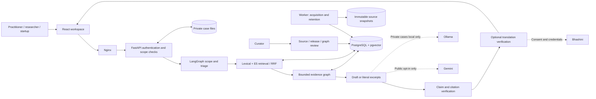
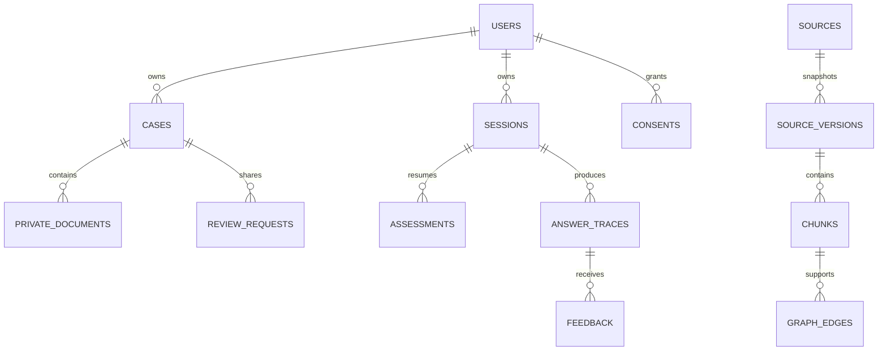
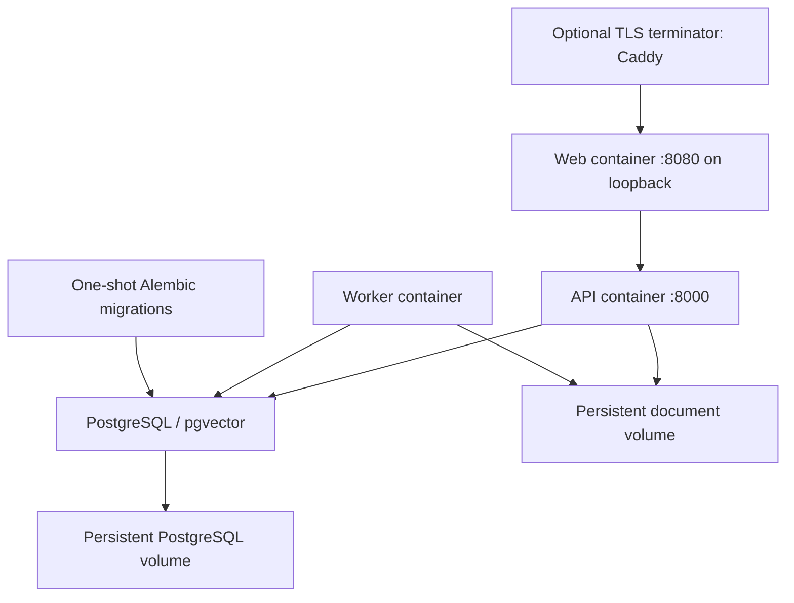

# IP-SAKTI Sahayak
## Complete Deployable Pilot — Project Report

Prepared 6 September 2026. Information, not legal advice. This report describes implemented software, observed evidence and outstanding external release gates.

## Purpose and beneficiaries

Ayurveda innovation crosses intellectual property, biological-resource access and product regulation. The pilot helps practitioners, researchers, startups, MSMEs and cultivators navigate those questions with inspectable sources. It separates jurisdictions and product categories instead of treating every herbal formulation as the same legal object.

## Delivered system

The workspace contains 60 registered source candidates, 63 acquired versions and 9236 chunks in the active reference release. The 18 supplied PDFs are preserved and checksummed. 0 versions are approved for generated current-law guidance. These counts distinguish acquisition from expert applicability review.

The application includes a multilingual assistant workspace, source viewer, formulation/ABS assessments, case ownership and imports, selected facilitator submissions, consent controls, administration, background acquisition/retention, bounded orchestration and graph evidence. It works in source-search mode without paid keys. External language and generation adapters have honest configuration states.

## Design decisions

Local embeddings avoid mandatory embedding subscriptions. PostgreSQL stores retrieval, graph and operational records together. Immutable source snapshots enable provenance inspection. Source review and answer generation are separate gates. Private facts are confined to local inference. Original legal excerpts remain available when translations cannot be verified.

## Acceptance and limitations

Mechanical tests and actual corpus execution provide evidence of behavior, not proof of legal accuracy. Qualified review, live provider validation, corpus completeness, production security hardening and deployment-specific DPDP applicability remain required. No public launch, facilitator staffing or paid source access has been provisioned.


---

# Architecture and data flow

The API enforces identity, jurisdiction, consent and source eligibility before invoking the model. Retrieval works without generation. A generated answer is released only after chunk-ID resolution, exact-quote validation and a second entailment check. A model judge remains fallible; expert evaluation is a separate gate.



## Trust boundaries

Browser input, uploaded documents, retrieved text and provider output are untrusted. Public-source snapshots and private case documents use separate paths and tables. Cases never enter public search. Source instructions cannot authorize tools, payments, uploads or connector access. The model has no general shell, database or network tool.

No cross-jurisdiction fallback is allowed. India uses market `treaties` as its neutral internal value; international retrieval additionally requires `treaties`, `us`, `eu` or `uk`. Comparison performs two independent retrieval runs. Graph expansion obeys the same source/version/jurisdiction filters.

## Database structure



`corpus_releases.version_ids` records the active snapshot set. `answer_traces` records hashed question, model configuration, prompt version, corpus release, returned chunk IDs and timing without storing raw guest questions. Case history is stored only when explicitly saved or queried within a signed-in case. `jobs` supports claims with PostgreSQL row locking, retries and interruption recovery. `evaluation_runs` stores reproducible report metadata. Database migrations create full-text GIN and pgvector HNSW indexes.

## Retrieval and execution limits

Section-aware page chunks retain raw offsets, headings and page numbers. The portable lexical path uses BM25-style weighting; PostgreSQL full-text retrieval augments it. Local E5 and lexical candidates are merged with reciprocal-rank fusion. English word normalization and an EN/HI/MR glossary improve matching. Category weighting helps distinguish patent questions from product classification questions. It is a retrieval heuristic, not a legal decision rule.

At most 8 initial chunks and 10 after graph expansion enter context. Graph edges are capped; the LangGraph recursion limit is 8, drafting returns at most 5 claims, and provider requests have timeouts. No unbounded autonomous research agent is enabled. Remote acquisition has publisher allowlisting, redirect checks and a 35 MB cap. OCR is explicit; recovered pages retain review warnings.

## Deployment



The default Compose deployment uses one API process. A shared gateway limiter and session-aware rate enforcement are required before scaling API replicas. Docker provides persistence, not disk encryption; the host or storage service must protect data at rest. No public hosting is provisioned.


---

# Feature and integration status

Status meanings: **implemented** = executable code and a usable route; **credential-required** = adapter exists but no live account test; **external review required** = a qualified person or deployment owner must complete the stated gate. Test evidence is in the generated evaluation and deployment reports.

| Feature | Delivery status | Limitation / completion gate |
|---|---|---|
| Assistant, jurisdiction and market controls | Implemented | India and treaties/US/EU/UK; member-state specifics need country sources |
| Source search/excerpts/citation viewer | Implemented | Reference-only material cannot establish current legal advice |
| PostgreSQL/pgvector and lexical/vector RRF | Implemented | Optional model image/indexing must be enabled; exact configuration shown in capabilities |
| Gemini and Ollama adapters | Credential/model-required | Live generation and entailment quality need evaluation |
| Formulation and ABS assessments | Implemented provisional flows | Rule completeness, legal review and route-specific evidence remain release gates |
| EN/HI/MR interface and questions | Implemented | Legal excerpts remain original; some operational/assessment explanations remain English |
| Bhashini translation, ASR and TTS | Credential-required | Pipeline/language availability, negation and botanical-name fidelity need live testing |
| Accounts, sessions, roles and case ownership | Implemented | Email verification, recovery and production abuse controls need hardening |
| Case save/resume, PDF/JSON and private import | Implemented | Private facts only with local inference; multilingual PDF rendering must be checked |
| Facilitator queue and selected sharing | Implemented | No facilitator staffing or response-time commitment supplied |
| Paid-source scopes/receipts/revocation/audits | Implemented connector boundary | No licensed vendor-specific connector available |
| TKDL and prior-art/registry pointers | Implemented | No restricted data, CAPTCHA bypass or patentability certification |
| Immutable snapshots, checksums and section/page offsets | Implemented | Original local PDFs preserved; source review remains pending |
| OCR and quality flags | Implemented optional recovery | Damaged/scanned pages require visual review; existing citations preserved |
| Source update worker, review, releases and rollback | Implemented | Regression review is an operator procedure, not automatic legal approval |
| Relational evidence graph and bounded LangGraph | Implemented | Curated legal relationships require review; no unrestricted agent tools |
| Privacy, audit, retention and account rights controls | Implemented pilot controls | DPDP/legal, threat-model and deployment review not complete |
| Docker, migrations, reverse proxy and health | Implemented | See actual rehearsal results; TLS requires deployment configuration |
| Backup/restore scripts | Implemented | Operator must schedule encrypted backups and expiry |
| 123 substantive trilingual scenarios + adversarial set | Implemented and executable | Templated families; qualified legal/language scoring pending |
| Report, presentation, diagrams, guides and demo script | Submission artifacts | Read the measured-results and limitations sections |

No integration is labelled credential-tested merely because its code compiles. No expert accuracy threshold is claimed met without an identified reviewer and scored sample. Public launch and hosting purchase are excluded.


---

# Evaluation report

Generated from actual executions; no simulated results.

Corpus release tested: `bf0d4eed-bd6a-4325-91ef-06294ec312ed`.
Automated backend tests: 63; failures: 0; errors: 0.
Docker/restore rehearsal: **passed**. Details: `docs/deployment-results.json`.

| Language | Executions | Retrieval / abstention | Citation resolution | Scope isolation | p50 / p95 ms |
|---|---:|---|---:|---:|---:|
| en | 127 | 117 / 10 | 100% | 100% | 377 / 642 |
| hi | 127 | 99 / 28 | 100% | 100% | 376 / 635 |
| mr | 127 | 105 / 22 | 100% | 100% | 382 / 747 |

## What these results establish

Returned chunk IDs resolve, original excerpts retain literal integrity, and returned citations stay within the selected jurisdiction/market. An abstention has no citations and therefore vacuously passes these mechanical checks; response counts must be considered. The adversarial set has only four scenarios per language, so 100% on that small set does not establish general safe-abstention accuracy.

## Unmeasured gates

Qualified substantive correctness, genuine citation relevance/entailment, complete safe-abstention accuracy, legal translation quality, and live voice quality remain **unmeasured**. The proposed 95% citation-support and 90% legal-correctness gates are not claimed met. Zero expert-reviewed scenarios are currently recorded. Source-only execution consumes no generation API tokens; hosted latency, quota and cost are not inferred from local timings.

## Reproduction

Run `python scripts/build_evaluation.py` then `python scripts/evaluate.py` using the same snapshot release. This dataset contains 123 substantive scenarios (41 topics × 3 evidence tasks), each in English/Hindi/Marathi, plus four adversarial scenarios in each language: 381 executions. Questions are templated families and need independent expert expansion. The runner saves per-execution trace IDs, citation IDs, modes, timings and null human scores.

## Hardware and conditions

```json
{
  "platform": "Windows-11-10.0.26200-SP0",
  "processor": "Intel64 Family 6 Model 197 Stepping 2, GenuineIntel",
  "python": "3.13.6"
}
```

Sequential actual-corpus calls; source-only mode. No paid tokens or model-generated answers.

The evaluator is sequential; HTTP concurrency, semantic-model latency and remote-provider performance require separate measurements. Run the deployment rehearsal for PostgreSQL/HTTP verification. Raw results: `evals/results/latest.json`; tests: `docs/test-results.xml`.

## Local semantic-retrieval sample

A separate 36-execution sample used the pinned, downloaded E5 model. Trace records show {'hybrid': 28, 'lexical': 0, 'null': 8}. These are actual retrieval modes; pre-retrieval abstentions have no retrieval mode. Source coverage and relevance still require expert review.

| Language | Sample n | p50 / p95 ms |
|---|---:|---:|
| en | 12 | 2788 / 3212 |
| hi | 12 | 2739 / 8973 |
| mr | 12 | 2772 / 2946 |


---

# Privacy, security and responsible AI controls

This document is a control mapping for a pilot, not certification or a completed legal assessment. The deployment owner must verify applicable DPDP provisions and their commencement dates for its actual processing, staffing and contracts. Operational defaults do not establish statutory compliance.

## Threat model

| Threat | Implemented boundary | Residual risk / deployment action |
|---|---|---|
| Cross-account case access | Server-side ownership on every case/document/export/review action | Penetration test and session monitoring |
| CSRF/session theft | Random opaque sessions, hashed tokens, CSRF checks, origin check, HttpOnly cookie, production Secure cookie | HTTPS and secure host required; account recovery not yet implemented |
| Prompt injection | Retrieved content is data, bounded workflow, no model-authorized tools, exact quote checks | Entailment judge can still fail; adversarial and expert review remain necessary |
| Fabricated citation | Model can cite only retrieved IDs; excerpts and source snapshots resolve internally | A real but irrelevant citation requires semantic review |
| Jurisdiction mixing | API source filters and separate graph context | Treaty membership/currentness still depends on reviewed corpus |
| Private upload leakage | Separate case tables/storage; owned-case validation; public retrieval excludes private text | Local Ollama must itself be trusted and locally controlled |
| Unpaid hosted processing of secrets | Explicit cloud opt-in, case/private blocks, confidential flag and sensitive-pattern gate | Pattern detection cannot recognize all sensitive facts; user notice and deployment policy required |
| Translation/voice disclosure | Per-operation consent, confidential gate, Bhashini endpoint allowlist | No live credentials tested; operator must approve terms and processing locations |
| SSRF through ingestion | HTTPS publisher allowlist, public DNS validation, redirect/size/time bounds | Network egress controls are recommended for defense in depth |
| Malicious upload/HTML | PDF/TXT signatures, size limits, extraction handling, HTML snapshots downloaded as attachments | Isolate and patch PDF/OCR dependencies; antivirus scanning is not implemented |
| Exhaustion | Per-session minute limits, daily question cap, bounded context and provider calls | Distributed limits needed before horizontal scaling; auth abuse/email verification need production hardening |
| Unauthorized paid access | Consent scope/expiry/revocation checked server-side; receipts and audits | No actual paid vendor enabled |
| Source drift | Immutable source bytes, review queue, explicit activation, rollback and stale indicators | Human amendment review required; inaccessible sources remain gaps |

## DPDP-oriented processing map

| Processing | Purpose and minimization | Control / owner responsibility |
|---|---|---|
| Guest questions | Answer a question; raw query not stored in audit | Hash and trace metadata retained; session expires after 24 hours |
| Optional accounts | Save and manage cases | Email and Argon2 password hash; account export/deletion |
| Saved cases/private documents | User-requested case workspace | Ownership isolation, explicit upload permission, 90-day inactivity default |
| Facilitator review | User-selected summary and optionally history | Separate immutable submission copy; no automatic external message |
| Bhashini | Requested translation, ASR or TTS | Opt-in, sensitive-data block, no raw-audio persistence |
| Paid connector consent | Enable a named permitted scope | Receipt, purpose, expiry, revocation and access audit |
| Audit/backup | Investigation and recovery | Content-minimized logs; reviewed retention schedule and protected backup storage |

The owner must complete notices, grievance contact, lawful basis/consent wording, processor contracts, rights-handling procedures, child-user policy, applicable transfer restrictions, incident notification procedure and data-retention obligations before public operation. Implementation covers export/delete/withdrawal controls but does not appoint a DPO or certify legal compliance.

The DPDP Rules 2025 have staged commencement: record applicability at the provision level using the official notification. Do not describe every rule as already operative solely because it was published. The acquisition manifest records the official rules resource; qualified review is pending.

## NIST AI RMF and OWASP mapping

- **Govern:** feature-status register, model/corpus versions, role separation, facilitator escalation and release limitations.
- **Map:** explicit jurisdictions, product-category triage, user population, private/public source separation and threat model.
- **Measure:** multilingual scenarios, citation integrity, jurisdiction isolation, abstention tests, observed latency and explicit unmeasured legal accuracy.
- **Manage:** source review, generation gates, bounded calls, provider fallback, rollback and incident response.

OWASP LLM risks are addressed through prompt/data separation, untrusted-output rendering, scoped retrieval, secret isolation and access controls outside the model. These controls are partial risk treatments, not evidence of OWASP or NIST certification.

## External references

- [Official DPDP Rules 2025](https://www.meity.gov.in/static/uploads/2025/11/53450e6e5dc0bfa85ebd78686cadad39.pdf).
- [NIST AI Risk Management Framework](https://www.nist.gov/itl/ai-risk-management-framework).
- [OWASP Top 10 for LLM Applications](https://genai.owasp.org/llm-top-10/).
- [Gemini API terms](https://ai.google.dev/gemini-api/terms) and [pricing/quotas context](https://ai.google.dev/gemini-api/docs/pricing).

These are implementation references; provider terms and legal applicability must be rechecked when configuring a deployment.


---

# Deployment and operations runbook

## Installation

Run `python scripts/configure.py`, then `docker compose up -d --build`. The configuration generator refuses to overwrite an existing file and never prints secrets. Use `docker compose ps` and `docker compose logs --tail=100 api worker migrate` to diagnose startup. Health requires a reachable database. Nginx serves the built client and proxies `/api/`.

For this workspace's rehearsal use `--env-file .env.docker` on every Compose command. Do not copy that file into a submission or commit it. For a fresh deployment create a new `.env`. Configure a real HTTPS `PUBLIC_ORIGIN`, `COOKIE_SECURE=true` and `APP_ENV=production` before exposing the app. `deploy/Caddyfile.example` shows TLS termination; the owner supplies domain, certificate configuration and hosting.

## Corpus release procedure

1. Generate the manifest: `python scripts/build_manifest.py`.
2. Acquire local PDFs and remote candidates using the CLI. `--pending` skips sources that already have chunks. The worker checks public sources daily; it does not automatically activate changes.
3. Inspect actual snapshot contents, publisher provenance, checksum, extraction quality, effective dates, amendment relationships and access conditions. Empty or inaccessible sources cannot support answers.
4. Use `python -m app.cli ocr --source SOURCE_ID` inside the container for sparse/scanned pages. OCR appends new recovered chunks, preserving previous identifiers. A curator must inspect recovery quality. Approved extractions cannot be changed through this command.
5. For discovery only, `reference-release` creates a visibly reference-only release. To enable generated legal information, a qualified curator must review source applicability and set approved status with a meaningful note. Drafts, notices, statistics and forms cannot become governing answer authority.
6. Run benchmark and focused regression tests. Review source/version changes and record results with the release note. Select at most one version per source and activate the candidate release through the admin interface.
7. Roll back by activating the prior release. Do not delete source snapshots that existing citations reference. A withdrawn source must be marked rejected and the replacement release activated.

Source statuses can change after a release; saved traces preserve IDs but current eligibility is deliberately reevaluated. Full historical legal reconstruction needs the review audit and source snapshots, not a current source status alone.

## Backups and recovery

`scripts/backup.sh /encrypted/backup/directory` writes a custom-format PostgreSQL dump and paired document archive. Run from a shell with Docker access. In rehearsal export `ENV_FILE=.env.docker` and use equivalent `docker compose --env-file .env.docker` commands. On Windows, the Python rehearsal script provides a binary-safe backup/restore check.

Store both files together, restrict access and encrypt backups. Retain backups for no more than the documented 30-day operational default unless a reviewed legal retention requirement applies. Schedule rotation with the deployment's backup system; this project does not provision an external backup service. Record checksum, timestamp and release ID. Test restoration into an isolated database and document volume before relying on the backup.

`scripts/restore-check.sh database.dump` restores into `ipsakti_restore_check` and never overwrites the live database. An existing restore-check database causes the command to stop. Verify source counts, cases, permissions and document checksums before a production recovery. After recovery reapply deletion requests and consent revocations that postdate the backup. Explicitly retire the isolated restore database when finished.

## Incident handling

For suspected leakage, disable hosted generation and external language processing, restrict ingress, preserve content-minimized audit evidence, rotate affected credentials and invalidate sessions. Identify affected cases and connector consents, investigate the actual data path and involve the designated privacy/security owner. The owner determines applicable notification obligations and deadlines with qualified counsel. Do not place raw case documents in issue trackers or general logs.

## Retention and availability

The worker purges expired sessions (guest default 24 hours), inactive cases (90 days), associated files and aged traces/audits (365-day configurable operational default). Raw audio is processed in memory and is not deliberately persisted. These defaults are product choices pending legal review. Database and archive backups must follow their own expiry schedule.

Provider outages, quotas and missing credentials fall back to source excerpts or explicit unavailability. Registry CAPTCHA requires user navigation. Paid connectors have no live implementation until a subscription and permitted interface are supplied. Do not bypass access controls.

## Upgrade checklist

Back up; rebuild pinned dependencies; apply migrations; run tests; review OpenAPI changes; regenerate frontend types; run the benchmark against the candidate corpus; inspect language and jurisdiction behavior; smoke-test on the intended hardware; record limitations. Dependency and container pins require deliberate security updates. Never activate a new legal corpus merely because acquisition succeeded.


---

# Using IP-SAKTI Sahayak

1. Select **India** or **International**. In the international workspace select treaty-level guidance, US, EU or UK. Switching jurisdiction opens a separate answer history.
2. Choose English, Hindi or Marathi. Interface language does not automatically translate a statute; original excerpts remain visible and translated text is labelled when the service is available.
3. Ask a general IP/regulatory question or open formulation classification/ABS. Do not enter patient information or an unpublished invention into a hosted-provider question. The confidential control routes away from free hosted generation.
4. Read the evidence status. **Supported** indicates generated claims passed the configured evidence checks; **Partial** indicates reference excerpts or incomplete support; **Insufficient** means no supported answer was released. None is a probability of legal correctness.
5. Open each citation to inspect the exact excerpt, page/heading, snapshot checksum, retrieval date, review status and official link. Source age and legal applicability are different facts.
6. Use classification to identify a provisional product route. Answer only the presented relevant questions; choose uncertain when facts are missing. A patent-or-proprietary medicine is not proof of a granted patent.
7. Use ABS to collect applicant, origin, purpose, transfer, IP-stage and TK facts. It provides an authority checklist, not an approval or automatic exemption.
8. Prior-art search produces terms and official navigation links. A search is not a freedom-to-operate or patentability opinion. TKDL restricted access is not bypassed.

## Cases and review

Sign in to save a case. Reopen it from **My cases** with the Assistant button. Only that case's owner can access its private imports. Confirm permission before uploading PDF/TXT. Private documents are user evidence, never public legal authority. Local inference is required to use them in answer generation.

Export JSON or a PDF brief. To request facilitator review, write a summary and explicitly select whether to include history. Submission creates a queue entry; it does not email anyone or promise a response time. An unassigned case requires the owner to connect a qualified facilitator team.

## Voice and availability

When Bhashini is configured, record a short question after agreeing to processing. Review and edit the transcript before sending. Playback uses explicit consent. Missing credentials or unsupported services show an availability message while text search continues to work. Automated numeric-reference checks do not replace qualified translation review.

## Your data

Use **Settings & privacy** to inspect integrations, consent receipts, revoke connector access, export the account or delete it. The worker handles inactivity expiry. Backups expire under the deployment's retention policy; deletion from an old backup is applied during recovery.


---

# Curator and facilitator guide

## Source curator

Authenticate with a curator or administrator account. Open **Corpus administration**. Review source bytes, extraction quality, original publisher, effective dates, amendment completeness and authority class. Local filenames and government-hosted indexes are not proof of a current consolidated statute. A source may be reference-only even when its publisher is authoritative.

Never approve a draft, consultation notice, statistical report or form as governing law. The UI/API enforce that distinction. Use a specific review note describing provisions checked, version limitations and any OCR recovery. Source approval is a professional responsibility; the software cannot supply the reviewer's expertise.

Enqueue update checks. Inspect failed jobs and publisher errors; do not substitute search snippets for unavailable source text. Create a release selecting one eligible version per source. Record benchmark and review results in its note, activate it, and retain the previous release for rollback.

## Evidence graph

Use the authenticated OpenAPI endpoint `POST /api/v1/admin/graph` with subject, relation, object, evidence chunk ID and reviewed flag. Allowed relations are `defines`, `requires`, `administered_by`, `amends`, `references` and `applies_to`. Read the cited passage before marking an edge reviewed. The graph stores relationships and evidence in PostgreSQL; unreviewed edges do not expand retrieval. No unstated treaty membership or legal obligation should be inferred from a broad overview page.

## Facilitator

Create a facilitator account through the CLI. The **Review desk** shows only shared submissions, not unrestricted access to all private cases. Move a submission through submitted → assigned → in review → resolved. Assignment and resolution require server-enforced roles. Only the assigned reviewer or authorized administrator can advance protected states.

The submitted summary/history is the exact content chosen by the user. Record a response that identifies missing facts, jurisdiction, sources, limitations and recommended next action. Resolution in this application is a workflow state, not a legal certification or a filed application. No communication is sent to third parties automatically.

## Evaluation review

`evals/scenarios.jsonl` includes rubric fields and unreviewed flags. Qualified reviewers should score substantive correctness, responsiveness of citations, safe abstention and language meaning, including negation, quantities, dates and botanical names. Store reviewer role, date, language, source release and notes. Do not promote automated literal-containment scores into legal-accuracy scores. The proposed 95% citation-support and 90% substantive-correctness targets remain unmet until reviewed data establishes them.


---

# Demonstration script — 8 minutes

**0:00–0:45 — Scope.** Open the assistant. Identify the India/international control and information-not-legal-advice notice. Explain the difference between a deployed retrieval pilot and professionally reviewed legal guidance.

**0:45–2:00 — Traceability.** Ask “Can a traditional Ayurvedic formulation be patented?” Open a citation. Show its source excerpt, page, snapshot date, review status and official link. In the default configuration describe the response as original excerpts, not generated legal advice.

**2:00–3:00 — Jurisdiction.** Switch to International/PCT or US. Ask about PCT application procedure or botanical-drug development. Show that India history and citations do not migrate into this context. Switch back to verify independent history.

**3:00–4:00 — Classification.** Start a therapeutic product assessment, choose authoritative-text and formulation facts, and inspect the provisional route. Restart it to show unanswered questions. Explain that patent-or-proprietary is a drug-regulatory term.

**4:00–5:00 — ABS.** Complete the resource-origin, applicant, purpose, transfer and IP questions. Show the checklist, citations and missing facts. Avoid claiming a fee calculation or automatic exemption.

**5:00–6:00 — Language and sources.** Change interface to Hindi and Marathi. Show original-law excerpts. Open source library and coverage. If Bhashini keys are absent, demonstrate the honest unavailable state rather than prerecorded speech masquerading as live output.

**6:00–7:00 — Case privacy.** Sign in with a prepared account, save a case, upload a harmless document with permission, export it and submit a selected summary for review. Show the unassigned queue state if no facilitator is connected. Use fictional demonstration content clearly labelled as such.

**7:00–8:00 — Evaluation and handoff.** Show actual evaluation results and test report. Separate citation mechanics from unmeasured legal/language correctness. Open the Docker runbook, coverage gaps and credential checklist. State the next release gates: expert corpus review, provider validation, legal/language evaluation and production privacy/security sign-off.


---

## Source traceability and reproducibility

The complete resource bibliography is generated in README.md. corpus/inventory.json retains source version identifiers, byte checksums, retrieval dates, extraction diagnostics and release membership. corpus/coverage.md identifies searchable/approved scope and known gaps. Source snapshots remain under data/snapshots or the Docker document volume; reacquisition commands are in the runbook. Do not redistribute proprietary pharmacopoeial or restricted registry content without permission.

## Next release gates

Complete qualified source and classification review; acquire missing legal instruments and permitted standards; score answer responsiveness and legal correctness; validate all three languages and live voice; test hosted/local generation against the reviewed corpus; complete production authentication/abuse/privacy review; assign a facilitator team; rehearse encrypted backup rotation and incident response on the intended host.
